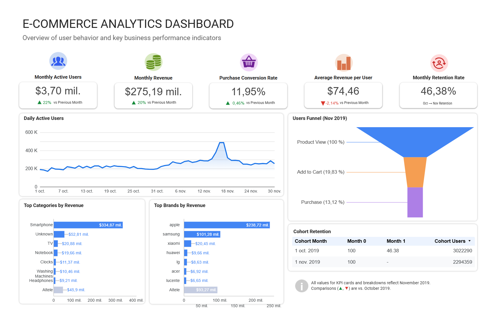

# E-Commerce User Behavior Analytics


Business Intelligence project built with **Google BigQuery** and **Looker Studio** to analyze customer behavior, conversion, revenue, and retention using real-world e-commerce event data.

## Dashboard Preview

🔗 **[View Interactive Dashboard](https://datastudio.google.com/reporting/2246edc2-0e4c-46c9-85e6-1bba481e9018)**



## Project Overview

This project analyzes customer behavior in a large multi-category e-commerce store using Google BigQuery, Standard SQL, and Looker Studio.

The analysis is based on the *eCommerce Behavior Data from Multi Category Store* dataset published on [Kaggle](https://www.kaggle.com/datasets/mkechinov/ecommerce-behavior-data-from-multi-category-store). The dataset consists of two monthly event files covering **October 2019** and **November 2019**, enabling month-over-month comparisons of user engagement, revenue, conversion, and retention.

Each row in the dataset represents a user interaction with the platform, including events such as:

* Product View
* Add to Cart
* Purchase

The project demonstrates how event-level data can be transformed into business metrics and interactive dashboards that support data-driven decision making.

## Business Objectives

The project aims to answer the following business questions:
- How many users actively use the platform each month?
- How has revenue changed from October to November?
- What percentage of active users complete a purchase?
- Which product categories generate the highest revenue?
- Which brands contribute the most to total sales?
- Where do users drop off in the purchase funnel?
- How many users return the following month?
- What is the monthly retention rate?

## Tech Stack 

- ☁️ Google Cloud Storage
- 📊 Google BigQuery
- 🗄️ SQL (Standard SQL)
- 📈 Looker Studio
- 🐙 GitHub

## Project Architecture

The project follows a modern cloud-based analytics pipeline, transforming raw event data into business insights through Google Cloud and Looker Studio.

```text
Kaggle Dataset (CSV)
        │
        ▼
Google Cloud Storage
        │
        ▼
BigQuery Raw Tables
        │
        ▼
Partitioned Analytics Table
        │
        ▼
SQL Queries & Views
        │
        ▼
Looker Studio Dashboard
```

### Pipeline Overview

1. **Kaggle Dataset** – The project uses the *eCommerce Behavior Data from Multi Category Store* dataset containing real-world e-commerce event data.

2. **Google Cloud Storage** – The CSV files were uploaded to Google Cloud Storage because they exceeded the BigQuery Sandbox local upload limit.

3. **BigQuery Raw Tables** – The original October and November datasets were imported into separate raw tables without modifications.

4. **Partitioned Analytics Table** – The raw tables were combined into a single partitioned table to improve query performance and reduce the amount of data scanned.

5. **SQL Queries & Views** – Exploratory queries, KPI calculations, funnel analysis, retention analysis, and dashboard views were created using Standard SQL.

6. **Looker Studio Dashboard** – The final interactive dashboard visualizes the business metrics and insights generated from the SQL queries and views.

## Repository Structure

```text
ecommerce-user-behavior-analytics/
│
├── README.md
├── LICENSE
├── dashboard.png
└── sql/
    ├── 01_exploratory_analysis.sql
    ├── 02_dashboard_views.sql
    └── 03_validation_queries.sql
```

### SQL Scripts

| File | Description |
|------|-------------|
| **01_exploratory_analysis.sql** | Exploratory SQL queries covering KPIs, revenue, conversion, funnel analysis, retention, churn, cohort analysis, and business insights. |
| **02_dashboard_views.sql** | Creates the SQL views used as data sources for the Looker Studio dashboard. |
| **03_validation_queries.sql** | Independent validation queries used to verify dashboard metrics and ensure calculation accuracy. |

## Dashboard Metrics

The interactive dashboard provides an overview of the platform's business performance through the following KPIs and visualizations.

### Key Performance Indicators (KPIs)

- **Monthly Active Users (MAU)** – Total number of unique users active during the selected month.
- **Monthly Revenue** – Total revenue generated from completed purchases.
- **Purchase Conversion Rate** – Percentage of users who completed at least one purchase.
- **Average Revenue per User (ARPU)** – Average revenue generated per active user.
- **Monthly Retention Rate** – Percentage of users who returned in the following month.

### Visualizations

- **Daily Active Users Trend** – Daily user activity throughout the month.
- **User Purchase Funnel** – User progression from product views to purchases.
- **Top Product Categories by Revenue** – Highest revenue-generating product categories.
- **Top Brands by Revenue** – Highest revenue-generating brands.
- **Cohort Retention Analysis** – User retention across monthly cohorts.

## Key Insights

The analysis of October and November 2019 revealed several important business insights:

- Monthly Active Users increased by **22.3%**, indicating continued platform growth.
- Revenue increased by **19.7%**, reaching **$275.2 million** in November.
- Purchase Conversion Rate improved from **11.49%** to **11.95%**.
- Average Revenue per User (ARPU) decreased by **2.14%**, suggesting that revenue growth was primarily driven by user acquisition rather than increased customer spending.
- Approximately **46%** of October users returned in November, indicating moderate month-over-month customer retention.
- The **Smartphones** category generated the highest revenue across all product categories.
- **Apple** was the highest revenue-generating brand.
- The largest drop-off in the purchase journey occurred between the **Product View** and **Add to Cart** stages, highlighting an opportunity to improve conversion earlier in the customer journey.

## Future Improvements

Potential enhancements for future versions of this project include:

- Extend the analysis to the complete seven-month dataset.
- Build multi-month cohort retention analyses.
- Perform customer segmentation using RFM analysis.
- Add geographic and seasonal sales analyses.
- Create customer lifetime value (CLV) metrics.
- Automate dashboard refresh using scheduled BigQuery queries.
